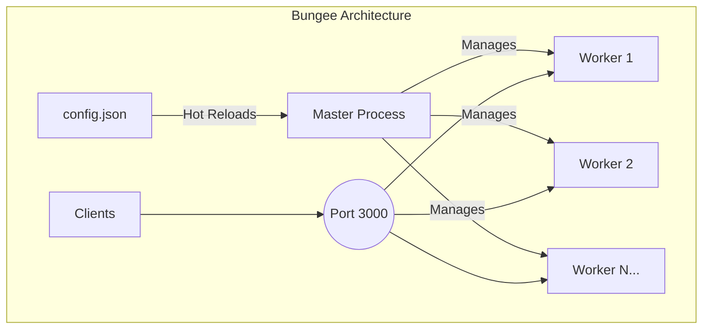

<div align="center">
  <pre>
    ____
   / __ )____  ____  __  __
  / __  / __ \/ __ \/ / / /
 / /_/ / /_/ / /_/ / /_/ /
/_____/\____/\____/\__,_/

  </pre>
  <h1>Bungee</h1>
  <p><strong>A high-performance, configurable reverse proxy server built for the Bun runtime.</strong></p>

  <p>
    <a href="https://github.com/jeffusion/bungee/actions/workflows/ci.yml">
      
    </a>
    <a href="https://github.com/jeffusion/bungee/releases">
      
    </a>
    <a href="https://github.com/jeffusion/bungee/blob/main/LICENSE">
      
    </a>
    <a href="https://github.com/jeffusion/bungee/stargazers">
      
    </a>
  </p>
</div>

A high-performance, configurable reverse proxy server built with Bun and TypeScript, featuring hot configuration reloading, a multi-process architecture, and robust failover mechanisms.

## Why Bungee?

In the rapidly evolving JavaScript ecosystem, Bun has set a new standard for speed and efficiency. Bungee was created to provide a reverse proxy solution that is not only native to this high-performance environment but also embraces the simplicity and power of TypeScript for configuration and management.

Unlike traditional reverse proxies like Nginx, Bungee allows you to manage your infrastructure with the same tools and languages you use for your applications. It's designed for developers who want a fast, lightweight, and programmable gateway without leaving the comfort of the JS/TS ecosystem.

This server allows you to define routing rules in a `config.json` file, and for each route, you can dynamically modify request headers and bodies before they are forwarded to the target service.

## Features

| Feature | Description |
|---|---|
| **🚀 High-Performance** | Built on [Bun](https://bun.sh/), one of the fastest JavaScript runtimes, for maximum throughput and low latency. |
| **🔄 Zero-Downtime Reloads** | Modify your `config.json` and Bungee will perform a graceful, rolling restart of its worker processes with no service interruption. |
| **⚖️ Multi-Process Load Balancing**| Automatically spawns multiple worker processes to leverage all available CPU cores, with the OS handling load balancing. |
| **🔧 Dynamic Configuration** | All routing and modification rules are defined in a simple `config.json` file. No complex scripting required. |
| **✍️ Header & Body Modification** | Add, remove, or set default fields in request headers and JSON bodies on-the-fly for any route or upstream. |
| **🔗 Failover & Health Checks** | Automatically detects unhealthy upstreams and reroutes traffic to healthy ones. |
| **📜 Structured Logging** | Production-ready structured logging with [Pino](https://getpino.io/), featuring log rotation, archival, and automatic cleanup. |
| **🐳 Docker-Ready** | Comes with a multi-stage `Dockerfile` and `docker-compose.yml` for easy containerized deployment. |
| **🤖 Automated Releases** | Integrated with `semantic-release` for fully automated versioning and changelog generation. |
| **✅ TypeScript First** | Fully written in TypeScript for better maintainability and type safety. |

## Architecture

Bungee operates on a master-worker model to ensure high availability and efficient use of system resources.



- **Master Process**: Responsible for monitoring `config.json` for changes, managing worker processes, and handling graceful shutdowns. It does not handle any network traffic itself.
- **Worker Processes**: A pool of worker processes (defaults to 2, configurable) listens on the same port, allowing the OS to efficiently load balance incoming requests.
- **Zero-Downtime Reloads**: When `config.json` is modified, the master process performs a rolling restart, gracefully shutting down old workers and starting new ones one by one, ensuring no service interruption.

## Project Structure

The project follows a standard structure for modern TypeScript applications:

```
.
├── src/
│   ├── master.ts       # Master process entry point
│   ├── worker.ts       # Worker process (server logic)
│   ├── config.ts       # Configuration loading and validation
│   └── logger.ts       # Pino logger setup
├── config.json         # Server configuration file
├── package.json        # Project metadata and scripts
├── tsconfig.json       # TypeScript configuration
├── Dockerfile          # For building the container image
├── docker-compose.yml  # For orchestrated deployment
├── .dockerignore       # To exclude files from the Docker build
├── .env.example        # Environment variable template
└── README.md           # This file
```

## Getting Started

### Prerequisites

- [Bun](https://bun.sh/docs/installation) installed on your system.

### Configuration

1. **Edit `config.json`**:
    Modify the `config.json` file to define your routes and modification rules. See the configuration section below for details.

### Running the Server

- **Development Mode** (with hot-reloading and pretty-printed logs):

    ```bash
    bun dev
    ```

- **Production Mode**:

    ```bash
    bun start
    ```

No `bun install` is needed, as Bun will automatically handle dependencies on the first run.

## Configuration (`config.json`)

The server is configured entirely through the `config.json` file.

- `bodyParserLimit`: (Optional) The maximum size of the request body to parse (e.g., "50mb"). Defaults to "1mb".
- `routes`: An array of route objects.

Each `route` object has the following properties:

- `path`: The URL path prefix to match for this route.
- `upstreams`: A **required** array of one or more upstream objects.
- `headers`, `body`: (Optional) **Route-level** modification rules that apply to all upstreams.
- `failover`, `healthCheck`: (Optional) High-availability configurations.

Each `upstream` object in the `upstreams` array has:

- `target`: The URL of the upstream service.
- `weight`: A number representing the traffic proportion.
- `headers`, `body`: (Optional) **Upstream-level** rules that **merge with and override** the route-level rules.

## Rule Merging Logic

When both a route and its selected upstream define modification rules (`headers` or `body`), they are merged as follows:

- **`add` objects**: Properties are merged. If a key exists in both, the **upstream's value wins**.
- **`remove` arrays**: The two arrays are concatenated and de-duplicated.
- **`default` objects**: Properties are merged. If a key exists in both, the **upstream's value wins**.

### Example `config.json`

```json
{
  "routes": [
    {
      "path": "/api/data",
      // Route-level rules apply to all upstreams
      "headers": {
        "add": { "x-common-auth": "secret-token", "x-api-version": "1.0" },
        "remove": ["x-debug-info"]
      },
      "upstreams": [
        { "target": "https://service-a.com", "weight": 50 },
        {
          "target": "https://service-b-canary.com",
          "weight": 50,
          // Upstream-specific rules merge with and override route rules
          "headers": {
            "add": { "x-api-version": "1.1-canary" }, // Overrides route-level x-api-version
            "remove": ["x-old-header"] // Adds to the remove list
          }
        }
      ]
    }
  ]
}
```

## Contributing

Contributions are welcome! Please follow these guidelines:

- **Commit Messages**: This project follows the [Conventional Commits](https://www.conventionalcommits.org/en/v1.0.0/) specification. Commit messages will be automatically linted on commit.
- **Issues**: Please open an issue before starting work on a new feature or bug fix.
- **Pull Requests**: Please open a pull request with a clear description of your changes.

## License

This project is licensed under the MIT License. See the [LICENSE](LICENSE) file for details.

## Docker Deployment

The reverse proxy server is containerized and ready for production deployment using Docker.

### Prerequisites

- [Docker](https://docs.docker.com/get-docker/) installed on your system
- [Docker Compose](https://docs.docker.com/compose/install/) (optional, for orchestrated deployment)

### Environment Configuration

1. **Create a `.env` file** (copy from `.env.example`)

   ```bash
   cp .env.example .env
   ```

2. **Configure your environment variables** in `.env`

   ```env
   WORKER_COUNT=2
   PORT=3000
   LOG_LEVEL=info
   ```

### Docker Build and Run

#### Using Docker directly

1. **Build the image**

   ```bash
   docker build -t bungee .
   ```

2. **Run the container**

   ```bash
   docker run -d \
     --name bungee \
     -p 3000:3000 \
     -v $(pwd)/config.json:/usr/src/app/config.json:ro \
     -v $(pwd)/logs:/usr/src/app/logs \
     --env-file .env \
     bungee
   ```

#### Using Docker Compose (Recommended)

1. **Start the service**

   ```bash
   docker-compose up -d
   ```

2. **View logs**

   ```bash
   docker-compose logs -f bungee
   ```

3. **Stop the service**

   ```bash
   docker-compose down
   ```

4. **Rebuild and restart**

   ```bash
   docker-compose up -d --build
   ```

### Health Check

The container includes a built-in health check that monitors the `/health` endpoint.

```bash
# Check container health
docker ps

# Manual health check
curl http://localhost:3000/health
```

### Production Considerations

- **Logs**: Container logs are persisted to the `./logs` directory on the host
- **Configuration**: `config.json` is mounted as read-only for security
- **Environment**: Uses `.env` file for configuration management
- **Restart Policy**: Container automatically restarts unless explicitly stopped
- **Security**: Runs as non-root user inside the container

### Monitoring

The Docker Compose configuration includes optional monitoring with Watchtower. Uncomment the `watchtower` service to enable automatic container updates.

## Roadmap

Bungee is under active development. Here are some of the features we're planning for the future:

- [ ] **WebSocket Proxying**: Full support for proxying WebSocket connections.
- [ ] **gRPC Proxying**: Support for gRPC services.
- [ ] **Plugin System**: An extensible plugin system for custom logic and middleware.
- [ ] **Dashboard UI**: A web-based dashboard for monitoring traffic and managing configuration.
- [ ] **Automatic TLS/SSL**: Integration with Let's Encrypt for automatic certificate management.

Have an idea? Feel free to [open an issue](https://github.com/jeffusion/bungee/issues/new/choose) to suggest a feature!
