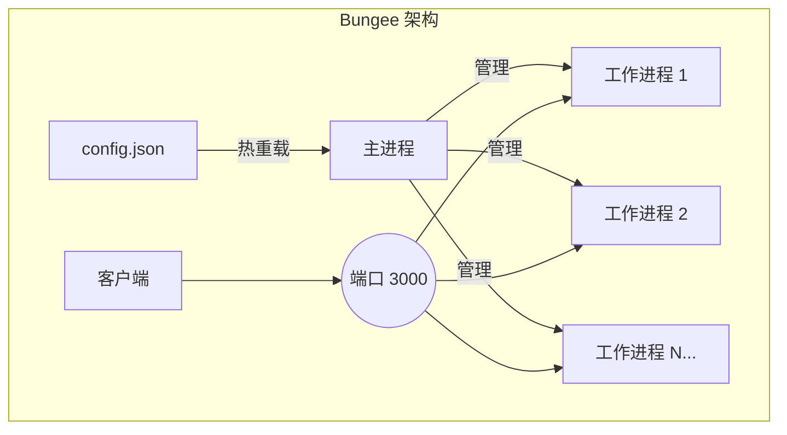

<div align="center">
  <pre>
    ____
   / __ )____  ____  __  __
  / __  / __ \/ __ \/ / / /
 / /_/ / /_/ / /_/ / /_/ /
/_____/\____/\____/\__,_/

  </pre>
  <h1>Bungee</h1>
  <p><strong>基于 Bun 运行时构建的高性能、可配置反向代理服务器。</strong></p>

  <p>
    <a href="https://github.com/jeffusion/bungee/actions/workflows/ci.yml">
      
    </a>
    <a href="https://github.com/jeffusion/bungee/releases">
      
    </a>
    <a href="https://github.com/jeffusion/bungee/blob/main/LICENSE">
      
    </a>
    <a href="https://github.com/jeffusion/bungee/stargazers">
      
    </a>
  </p>
</div>

**语言**: [English](README.md) | **中文**

基于 Bun 和 TypeScript 构建的高性能、可配置反向代理服务器，支持配置热重载、多进程架构和强大的故障转移机制。

## 为什么选择 Bungee？

在快速发展的 JavaScript 生态系统中，Bun 为速度和效率设定了新标准。Bungee 不仅提供了原生于这种高性能环境的反向代理解决方案，还拥抱了 TypeScript 的简洁性和强大功能来进行配置和管理。

与 Nginx 等传统反向代理不同，Bungee 允许你使用与应用程序相同的工具和语言来管理基础设施。它专为希望拥有快速、轻量级且可编程的网关，同时不离开 JS/TS 生态系统舒适区的开发者而设计。

该服务器允许你在 `config.json` 文件中定义路由规则，对于每个路由，你可以在将请求转发到目标服务之前动态修改请求头和正文。

## 功能特性

| 功能 | 描述 |
|---|---|
| **🚀 高性能** | 基于 [Bun](https://bun.sh/) 构建，JavaScript 运行时中最快的之一，提供最大吞吐量和低延迟。 |
| **🔄 零停机重载** | 修改你的 `config.json`，Bungee 将执行优雅的滚动重启其工作进程，无服务中断。 |
| **⚖️ 多进程负载均衡** | 自动产生多个工作进程以利用所有可用的 CPU 核心，由操作系统处理负载均衡。 |
| **🔧 动态配置** | 所有路由和修改规则都在简单的 `config.json` 文件中定义。无需复杂脚本。 |
| **✍️ 请求头和正文修改** | 为任何路由或上游动态添加、删除或设置请求头和 JSON 正文的默认字段。 |
| **🔗 故障转移和健康检查** | 自动检测不健康的上游并将流量重新路由到健康的上游。 |
| **📜 结构化日志** | 使用 [Pino](https://getpino.io/) 的生产就绪结构化日志，支持日志轮转、归档和自动清理。 |
| **🐳 Docker 就绪** | 配备多阶段 `Dockerfile` 和 `docker-compose.yml`，便于容器化部署。 |
| **🤖 自动化发布** | 集成 `semantic-release`，实现完全自动化的版本控制和变更日志生成。 |
| **✅ TypeScript 优先** | 完全用 TypeScript 编写，提供更好的可维护性和类型安全。 |

## 架构

Bungee 采用主-工作进程模型，确保高可用性和有效利用系统资源。



- **主进程**：负责监控 `config.json` 的变化、管理工作进程和处理优雅关闭。它本身不处理任何网络流量。
- **工作进程**：一组工作进程（默认 2 个，可配置）监听同一端口，允许操作系统高效地负载均衡传入请求。
- **零停机重载**：当修改 `config.json` 时，主进程执行滚动重启，优雅地关闭旧工作进程并逐一启动新工作进程，确保无服务中断。

## 项目结构

该项目遵循现代 TypeScript 应用程序的标准结构：

```
.
├── src/
│   ├── master.ts       # 主进程入口点
│   ├── worker.ts       # 工作进程（服务器逻辑）
│   ├── config.ts       # 配置加载和验证
│   └── logger.ts       # Pino 日志设置
├── config.json         # 服务器配置文件
├── package.json        # 项目元数据和脚本
├── tsconfig.json       # TypeScript 配置
├── Dockerfile          # 用于构建容器镜像
├── docker-compose.yml  # 用于编排部署
├── .dockerignore       # 从 Docker 构建中排除文件
├── .env.example        # 环境变量模板
└── README.md           # 本文件
```

## 快速开始

### 前置要求

- 在你的系统上安装 [Bun](https://bun.sh/docs/installation)。

### 配置

1. **编辑 `config.json`**：
   修改 `config.json` 文件以定义你的路由和修改规则。详细信息请参见下面的配置部分。

### 运行服务器

- **开发模式**（带热重载和美化打印的日志）：

    ```bash
    bun dev
    ```

- **生产模式**：

    ```bash
    bun start
    ```

无需运行 `bun install`，因为 Bun 将在首次运行时自动处理依赖项。

## 配置 (`config.json`)

服务器完全通过 `config.json` 文件进行配置。

- `bodyParserLimit`：（可选）要解析的请求正文的最大大小（例如，"50mb"）。默认为 "1mb"。
- `routes`：路由对象数组。

每个 `route` 对象具有以下属性：

- `path`：匹配此路由的 URL 路径前缀。
- `upstreams`：**必需**的一个或多个上游对象数组。
- `headers`、`body`：（可选）应用于所有上游的**路由级**修改规则。
- `failover`、`healthCheck`：（可选）高可用性配置。

`upstreams` 数组中的每个 `upstream` 对象有：

- `target`：上游服务的 URL。
- `weight`：表示流量比例的数字。
- `headers`、`body`：（可选）**上游级**规则，**与路由级规则合并并覆盖**。

## 规则合并逻辑

当路由及其选定的上游都定义修改规则（`headers` 或 `body`）时，它们按以下方式合并：

- **`add` 对象**：属性被合并。如果键在两者中都存在，**上游的值获胜**。
- **`remove` 数组**：两个数组被连接并去重。
- **`default` 对象**：属性被合并。如果键在两者中都存在，**上游的值获胜**。

### 示例 `config.json`

```json
{
  "routes": [
    {
      "path": "/api/data",
      // 路由级规则应用于所有上游
      "headers": {
        "add": { "x-common-auth": "secret-token", "x-api-version": "1.0" },
        "remove": ["x-debug-info"]
      },
      "upstreams": [
        { "target": "https://service-a.com", "weight": 50 },
        {
          "target": "https://service-b-canary.com",
          "weight": 50,
          // 上游特定规则与路由规则合并并覆盖
          "headers": {
            "add": { "x-api-version": "1.1-canary" }, // 覆盖路由级 x-api-version
            "remove": ["x-old-header"] // 添加到移除列表
          }
        }
      ]
    }
  ]
}
```

## 贡献

欢迎贡献！请遵循以下指南：

- **提交信息**：此项目遵循 [约定式提交](https://www.conventionalcommits.org/zh-hans/v1.0.0/) 规范。提交信息将在提交时自动检查。
- **问题**：在开始新功能或错误修复工作之前，请先打开一个问题。
- **拉取请求**：请提交一个拉取请求，并清楚描述你的更改。

## 许可证

此项目基于 MIT 许可证。详细信息请参见 [LICENSE](LICENSE) 文件。

## Docker 部署

反向代理服务器已容器化，可使用 Docker 进行生产部署。

### 前置要求

- 在你的系统上安装 [Docker](https://docs.docker.com/get-docker/)
- [Docker Compose](https://docs.docker.com/compose/install/)（可选，用于编排部署）

### 环境配置

1. **创建 `.env` 文件**（从 `.env.example` 复制）

   ```bash
   cp .env.example .env
   ```

2. **在 `.env` 中配置你的环境变量**

   ```env
   WORKER_COUNT=2
   PORT=3000
   LOG_LEVEL=info
   ```

### Docker 构建和运行

#### 直接使用 Docker

1. **构建镜像**

   ```bash
   docker build -t bungee .
   ```

2. **运行容器**

   ```bash
   docker run -d \
     --name bungee \
     -p 3000:3000 \
     -v $(pwd)/config.json:/usr/src/app/config.json:ro \
     -v $(pwd)/logs:/usr/src/app/logs \
     --env-file .env \
     bungee
   ```

#### 使用 Docker Compose（推荐）

1. **启动服务**

   ```bash
   docker-compose up -d
   ```

2. **查看日志**

   ```bash
   docker-compose logs -f bungee
   ```

3. **停止服务**

   ```bash
   docker-compose down
   ```

4. **重新构建并重启**

   ```bash
   docker-compose up -d --build
   ```

### 健康检查

容器包含内置健康检查，监控 `/health` 端点。

```bash
# 检查容器健康状态
docker ps

# 手动健康检查
curl http://localhost:3000/health
```

### 生产注意事项

- **日志**：容器日志持久化到主机上的 `./logs` 目录
- **配置**：`config.json` 以只读方式挂载以确保安全
- **环境**：使用 `.env` 文件进行配置管理
- **重启策略**：容器在明确停止之前自动重启
- **安全**：在容器内以非 root 用户运行

### 监控

Docker Compose 配置包含可选的 Watchtower 监控。取消注释 `watchtower` 服务以启用自动容器更新。

## 路线图

Bungee 正在积极开发中。以下是我们计划在未来实现的一些功能：

- [ ] **WebSocket 代理**：完全支持代理 WebSocket 连接。
- [ ] **gRPC 代理**：支持 gRPC 服务。
- [ ] **插件系统**：可扩展的插件系统，用于自定义逻辑和中间件。
- [ ] **仪表板 UI**：基于 Web 的仪表板，用于监控流量和管理配置。
- [ ] **自动 TLS/SSL**：与 Let's Encrypt 集成，实现自动证书管理。

有想法吗？欢迎 [提交问题](https://github.com/jeffusion/bungee/issues/new/choose) 来建议功能！